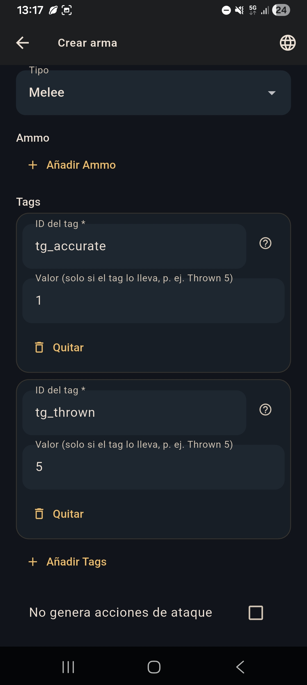
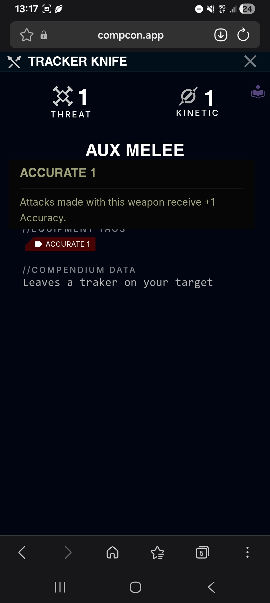
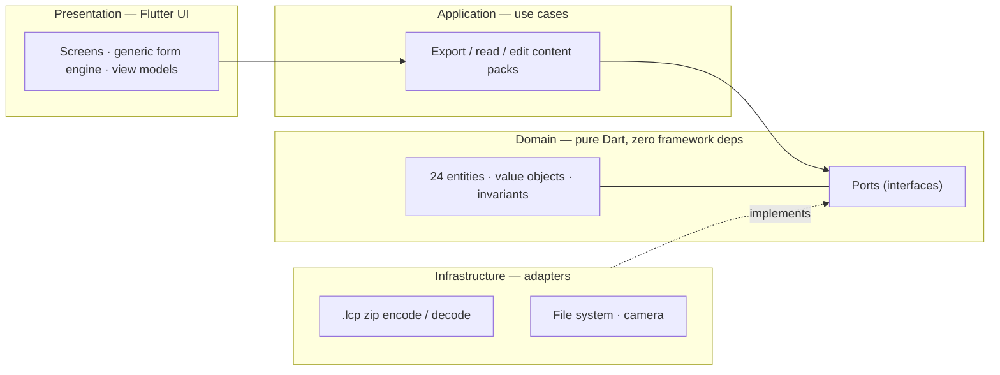

<div align="center">

# LCP Builder

**A visual editor for Lancer content packs — built as a software-architecture study piece.**

*Un editor visual de paquetes de contenido para Lancer — construido como pieza de estudio de arquitectura de software.*


</div>

---

> **🇬🇧 English** · [🇪🇸 Español](#-español)

## What it is

**LCP Builder** is a cross-platform desktop/mobile app that generates and edits `.lcp` files — the content-pack format consumed by [**COMP/CON**](https://compcon.app), the digital toolkit for the [**Lancer**](https://massifpress.com/lancer) tabletop RPG. It lets a game master with **zero technical background** author custom weapons, frames, pilot gear, NPCs and 20+ other entity types through plain visual forms, and drops out a `.lcp` they can import straight into COMP/CON.

An `.lcp` is a zip archive of JSON files matched against Lancer's core catalog. Hand-authoring one means writing schema-perfect JSON by hand — exactly the friction this tool removes.

<div align="center">

&nbsp;&nbsp;

<br>
<em>Left: authoring a weapon in LCP Builder. Right: the generated <code>.lcp</code> imported into COMP/CON.</em>
</div>

## Why it exists (the honest version)

This is a **portfolio project first, a shippable tool second** — a deliberate, documented priority. The goal isn't to finish an app as fast as possible; it's to build architectural judgement using a real problem with real constraints. Every non-trivial decision is captured as an [ADR](vault/ADRs/) and the reasoning lives in an Obsidian vault alongside the code. If you're a recruiter or engineer skimming this, the interesting parts aren't the features — they're the trade-offs below.

## What makes it interesting, engineering-wise

**A pure domain that knows nothing about Flutter.** The entire Lancer domain model — 24 entity types, their value objects and invariants — is plain Dart with **no imports of Flutter or `dart:io`**. Business rules can't be broken by a UI change, and the domain is testable without a single widget.



**Ports & adapters that paid off across 5 operating systems.** File I/O, zipping and image capture sit behind domain-owned *ports*; each platform gets its own *adapter* (Android's Storage Access Framework vs. desktop `dart:io`, etc.), chosen at the edge. The payoff is concrete and [was predicted in ADR-002](vault/ADRs/): Windows, macOS and iOS were added on top of the Android/Linux core with **effectively zero change to the domain**.

**A generic, data-driven form engine.** Rather than hand-coding 24 screens, the UI is a single form engine that renders declarative `FieldSpec` schemas — no code generation, no reflection. Adding an entity type is writing a schema, not a screen.

**Round-trip robustness, learned the hard way.** Real content exposed a class of bug where a value is a *number in a text field* (Lancer JSON is loose about this). The fix wasn't a patch at each end — it was coercing types **at the single hydration boundary** both display and save flow through, so fixing one direction couldn't silently break the other. That lesson is [written up in the vault](vault/Aprendizajes/).

**A testing strategy, not just tests.** **380+ tests** across unit, widget and *real-disk acceptance* levels (the acceptance suite writes and re-reads actual `.lcp` files on disk, sidestepping the `FakeAsync`/`dart:io` trap that silently hangs naive widget tests). CI builds and acceptance-tests every OS target.

## Tech stack

| | |
|---|---|
| **Language / framework** | Dart 3.12, Flutter 3.44 (Material 3) |
| **Architecture** | Clean / Hexagonal — isolated domain, ports & adapters |
| **Key packages** | `archive` (zip), `file_selector`, `intl` (l10n) |
| **Quality gates** | `flutter_lints`, `strict-casts`, 380+ tests |
| **CI** | GitHub Actions — per-OS builds + a combined 5-OS artifact, plus Android/Linux acceptance runs |

## Project structure

```
lcp-builder/
├── app/                        Flutter/Dart application
│   └── lib/
│       ├── domain/             pure Dart: entities, value objects, ports, enums
│       ├── application/        use cases
│       ├── infrastructure/     adapters: .lcp zip, file system, camera
│       └── presentation/       screens, generic form engine, theme, view models
└── vault/                      Obsidian vault — the "why" behind the code
    ├── ADRs/                   architecture decision records
    ├── Modelo de Dominio/      domain model reference
    └── Aprendizajes/           design principles & lessons learned
```

The `vault/` is the design log. Opened as an Obsidian vault it navigates by links and graph; on GitHub it reads as plain Markdown.

## Build & run

Requires the Flutter SDK (3.44+).

```bash
cd app
flutter pub get
flutter run                 # run on a connected device / desktop
```

Build a release binary for the current platform:

```bash
flutter build apk           # Android
flutter build linux         # Linux   (also: windows · macos · ios)
```

Pre-built binaries for all five targets are produced by the `build-all` GitHub Actions workflow as a single downloadable archive.

## Testing

```bash
cd app
flutter analyze             # static analysis (strict-casts, lints)
flutter test                # unit + widget + acceptance suite (380+ tests)
```

## Status

Active learning project. Core domain and the Create/Edit flows are implemented and tested across all five platforms; work continues through the vault's phase plan (ADR-003). The documented priority is architectural learning and portfolio value — feature completeness follows from that, not the other way around.

---

## 🇪🇸 Español

**LCP Builder** es una app multiplataforma (escritorio y móvil) que genera y edita archivos `.lcp` — el formato de paquetes de contenido que consume [**COMP/CON**](https://compcon.app), la herramienta digital del juego de rol de mesa [**Lancer**](https://massifpress.com/lancer). Permite que un máster **sin conocimientos técnicos** cree armas, frames, equipo de piloto, NPCs y más de 20 tipos de entidad a través de formularios visuales, y produce un `.lcp` listo para importar en COMP/CON.

Un `.lcp` es un zip de ficheros JSON que COMP/CON valida contra el catálogo del Core de Lancer. Escribirlo a mano significa teclear JSON perfecto de esquema — justo la fricción que esta herramienta elimina.

### Por qué existe

Es un **proyecto de portfolio primero y herramienta útil después** — una prioridad consciente y documentada. El objetivo no es terminar la app cuanto antes, sino **construir criterio de arquitectura** con un problema real. Cada decisión no trivial queda registrada como un [ADR](vault/ADRs/), y el razonamiento vive en una bóveda de Obsidian junto al código.

### Lo interesante a nivel de ingeniería

- **Un dominio puro que no sabe nada de Flutter.** Todo el modelo de dominio de Lancer (24 entidades, sus value objects e invariantes) es Dart puro, **sin importar Flutter ni `dart:io`**. La UI no puede romper reglas de negocio, y el dominio se testea sin un solo widget.
- **Puertos y adaptadores que rentaron en 5 sistemas operativos.** El I/O de ficheros, el zip y la cámara viven tras *puertos* del dominio; cada plataforma trae su *adaptador* (Storage Access Framework en Android vs. `dart:io` en escritorio…). El resultado, [previsto en el ADR-002](vault/ADRs/): Windows, macOS e iOS se sumaron sobre el núcleo Android/Linux **con cambio de dominio prácticamente nulo**.
- **Un motor de formularios genérico y guiado por datos.** En vez de programar 24 pantallas, la UI es un único motor que renderiza esquemas declarativos (`FieldSpec`) — sin generación de código ni reflexión. Añadir una entidad es escribir un esquema, no una pantalla.
- **Robustez de round-trip aprendida a golpes.** El contenido real destapó un bug donde un valor es *un número en un campo de texto*. El arreglo no fue parchear cada extremo, sino coaccionar los tipos **en el único punto de hidratación** por el que pasan mostrar y guardar. La lección está [escrita en la bóveda](vault/Aprendizajes/).
- **Una estrategia de tests, no solo tests.** **380+ tests** entre unitarios, de widget y de *aceptación contra disco real* (escriben y releen `.lcp` de verdad, esquivando la trampa `FakeAsync`/`dart:io` que cuelga los tests de widget ingenuos). CI compila y testea cada objetivo de SO.

### Stack

Dart 3.12 · Flutter 3.44 (Material 3) · arquitectura Clean/Hexagonal · `archive`, `file_selector`, `intl` · `flutter_lints` + `strict-casts` · GitHub Actions (builds por-SO + artefacto combinado de los 5, y aceptación en Android/Linux).

### Estructura y cómo retomar

- **`app/`** — código Flutter/Dart (dominio, aplicación, infraestructura, presentación).
- **`vault/`** — bóveda de Obsidian: ADRs, modelo de dominio, UI/UX y aprendizajes. El "porqué" detrás del código.

Para retomar el trabajo: abre `vault/` como bóveda en Obsidian, abre la raíz del repo con Claude Code (lee `CLAUDE.md` automáticamente) y sigue el estado y próximos pasos en `vault/00 - Inicio.md`.

### Compilar y probar

```bash
cd app
flutter pub get
flutter run          # ejecutar en dispositivo/escritorio
flutter analyze      # análisis estático
flutter test         # suite completa (380+ tests)
```

---

<div align="center">
<sub>Lancer is © Massif Press. This is an unaffiliated fan tool. · Lancer es © Massif Press. Herramienta de fans no afiliada.</sub>
</div>
